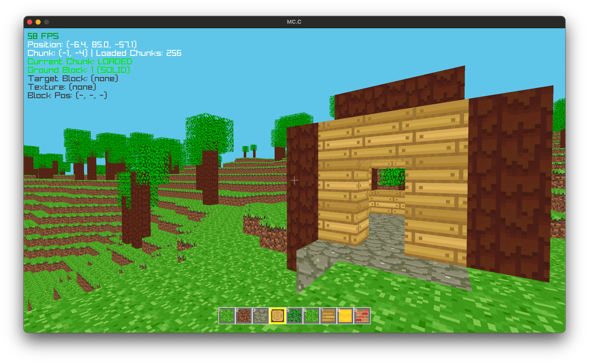

## MC.C



### Description

An open-world voxel game built with raylib, featuring open world gameplay with infinite terrain generation, block building, and first-person exploration. Built using a modular chunk system for efficient rendering and world management.

### Features

 - **First-person 3D exploration** with smooth WASD movement and mouse look
 - **Infinite voxel world** with chunk-based loading and procedural terrain generation
 - **Block interaction system** - place and destroy blocks with left/right mouse clicks
 - **Multiple block types** - grass, dirt, stone, wood, leaves, water
 - **Hotbar inventory** with 9 slots for different block types
 - **Realistic physics** - gravity, collision detection, and jumping
 - **Optimized rendering** - face culling, frustum culling, and efficient mesh generation
 - **Procedural terrain** - hills, valleys, water bodies, and tree generation

### Controls

Keyboard:
 - **WASD** - Move player
 - **SPACE** - Jump
 - **SHIFT** - Run/Sprint
 - **1-9** - Select block type from hotbar
 - **ESC** - Toggle cursor lock/unlock
 - **ENTER** - Return to main menu

Mouse:
 - **Mouse Movement** - Look around (first-person camera)
 - **Left Click** - Break/destroy blocks
 - **Right Click** - Place selected block

### Screenshots

_TODO: Show your game to the world, animated GIFs recommended!._

### Developers

 - $(Developer 01) - $(Role/Tasks Developed)
 - $(Developer 02) - $(Role/Tasks Developed)
 - $(Developer 03) - $(Role/Tasks Developed)

### Links

 - YouTube Gameplay: $(YouTube Link)
 - itch.io Release: $(itch.io Game Page)
 - Steam Release: $(Steam Game Page)

## Getting Started

#### Linux
When setting up this template on linux for the first time, install the dependencies from this page:
([Working on GNU Linux](https://github.com/raysan5/raylib/wiki/Working-on-GNU-Linux))

You can use this templates in some ways. Using Visual Studio, using CMake or make your own build setup. This repository come with Visual Studio and CMake already setuped.

Chose one of the follow setup, that fit in you development enviroment.

### Visual Studio

- After extracting the zip, the parent folder `raylib-game-template` should exist in the same directory as `raylib` itself.  So your file structure should look like this:
    - Some parent directory
        - `raylib`
            - the contents of https://github.com/raysan5/raylib
        - `raylib-game-template`
            - this `README.md` and all other raylib-game-template files
- If using Visual Studio, open projects/VS2022/raylib-game-template.sln
- Select on `raylib_game` in the solution explorer, then in the toolbar at the top, click `Project` > `Set as Startup Project`
- Now you're all set up!  Click `Local Windows Debugger` with the green play arrow and the project will run.

### CMake

- Extract the zip of this project
- Type the follow command:

```sh
cmake -S . -B build
```

> if you want with debug symbols put the flag `-DCMAKE_BUILD_TYPE=Debug`

- After CMake config your project build:

```sh
cmake --build build
```

- Inside the build folder are another folder (named the same as the project name on CMakeLists.txt) with the executable and resources folder.
- In order for resources to load properly, cd to `src` and run the executable (`../build/${PROJECT_NAME}/${PROJECT_NAME}`) from there.

- cmake will automatically download a current release of raylib but if you want to use your local version you can pass `-DFETCHCONTENT_SOURCE_DIR_RAYLIB=<dir_with_raylib>` 
