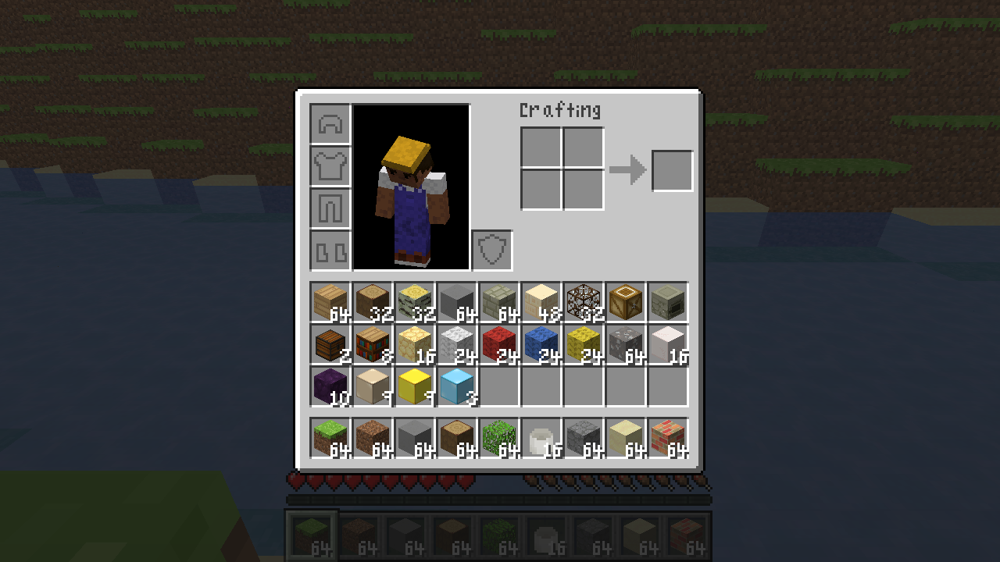
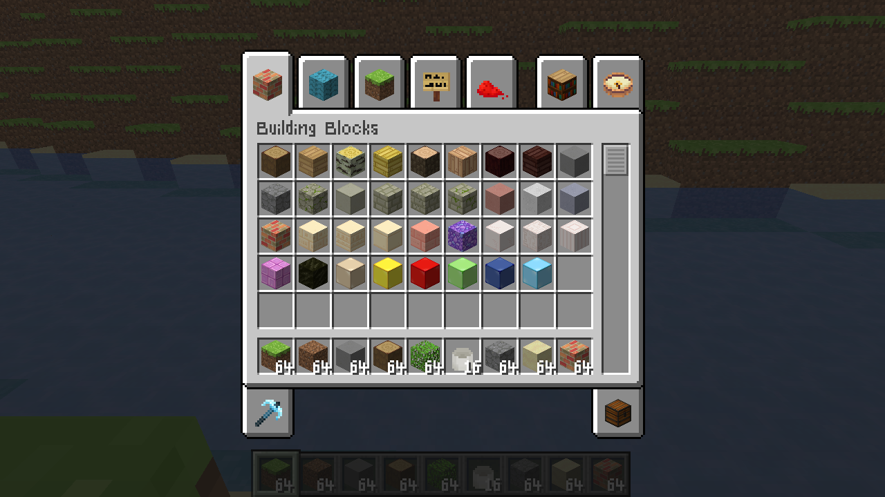
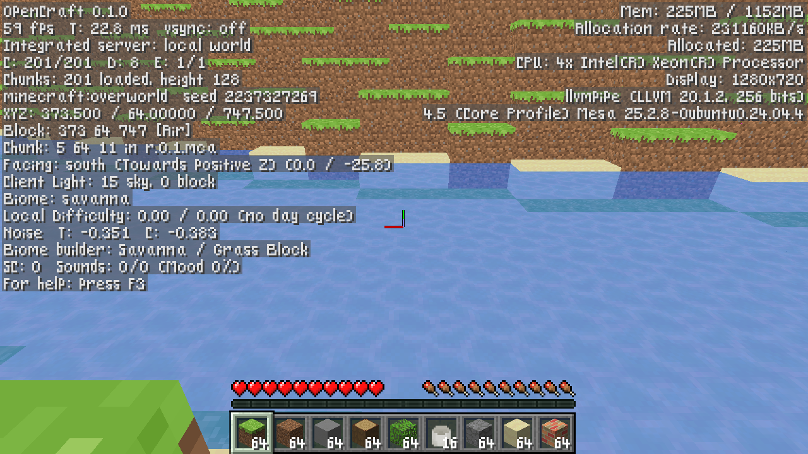
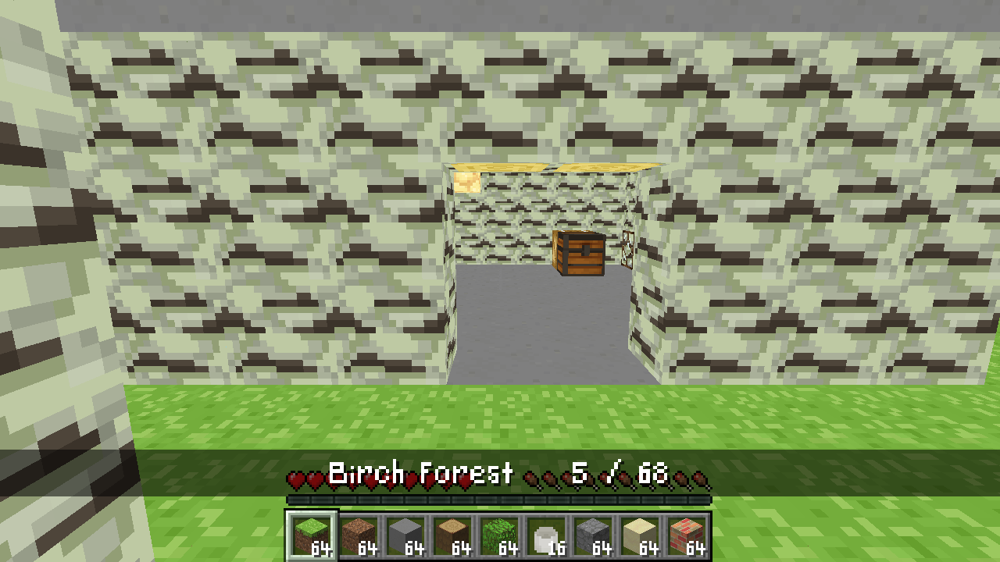

## OpenCraft


### Description

An open-world voxel game built with raylib, featuring open world gameplay with infinite terrain generation, block building, and first-person exploration. Built using a modular chunk system for efficient rendering and world management.

The Java Edition parity tracker lives in `docs/parity/`. `docs/parity/SLICES.md` is the ordered work, and `docs/parity/AGENT.md` is how an agent session takes one slice.

### Features

 - **First-person 3D exploration**
 - **Infinite voxel world** with chunk-based loading and procedural terrain generation
 - **Block interaction** - place and destroy blocks
 - **Multiple block types** - grass, dirt, stone, wood, leaves, water
 - **Hotbar inventory** with 9 slots for different block types
 - **Realistic physics** - gravity, collision detection, and jumping
 - **Optimized rendering** - face culling, frustum culling, and efficient mesh generation
 - **Procedural terrain** - hills, valleys, water bodies, and tree generation

### Menu


The game opens on the OpenCraft title screen.

- **Singleplayer** opens the world list. Play a world, create one, edit the name, re-create it, or delete it.
- **Multiplayer** asks you to sign in once, then shows saved servers. Realms stays coming soon.
- **Options...** and **Quit Game** do what they say.

Accounts exist only in the game. The first multiplayer screen asks for a username, a password, and an optional email. After that, Play Multiplayer is a list of saved servers, plus direct connect. Joining does not ask for the password again. The server stores a password hash in `opencraft.db`. Two clients on that server share one map. Each account keeps its own hotbar and held slot. Singleplayer worlds are unchanged.

Worlds live in `saves/world_<id>/`. `level.dat` is gzip NBT for the name, seed, spawn, and player. Edited chunks are zlib NBT in `region/r.<x>.<z>.mca`. `level.txt` is the menu index. Client output goes to `logs/latest.log`, and the next launch gzips that file to `logs/YYYY-MM-DD-N.log.gz`.

A new world gets a random seed. The create screen accepts a seed too; leave it blank to keep the random one. Hills, water, and trees are rebuilt from that seed. Blocks you place stay in the region file.

Water is a source block. It spreads seven steps, falls down holes, and becomes a new source where two sources meet on solid ground. Lakes and oceans fill the low ground with sand beds. A new world starts on a shore. The bucket on the hotbar picks up a source and places it again.

### In game


The hotbar shows the held blocks, with hearts and food above it.



Survival inventory has the player, armor slots, a crafting grid, and the storage rows.



Creative mode opens a tabbed item picker.



The debug screen lists the session, position, and biome. Each line sits on a gray band.


The pause menu covers the world.



The biome tour builds one small house in each biome, with a door, windows, and a furnished room.

## Getting Started

### CMake

- Extract the zip of this project
- Type the follow command:

```sh
cmake -S . -B build
```

> if you want with debug symbols put the flag `-DCMAKE_BUILD_TYPE=Debug`

- After CMake config your project build:

```sh
cmake --build build
```

- Inside the build folder are another folder (named the same as the project name on CMakeLists.txt) with the executable and resources folder.
- In order for resources to load properly, cd to `client` and run the executable (`../build/${PROJECT_NAME}/${PROJECT_NAME}`) from there.
- The dedicated server binary is `build/server/opencraft-server`. It does not open a window. From the repo root:

```sh
./build/server/opencraft-server --port 25570 --world world
```

That listens on `0.0.0.0:25570` and writes `world/opencraft.db`. Launch two clients from `client/` with `../build/mcc/mcc`. In Multiplayer, create an account or log in once, then join a saved server. `session_test` checks that a rejoin keeps the map and the hotbar. `MCC_BIOME_TOUR=1` walks every biome palette.

- cmake will automatically download a current release of raylib but if you want to use your local version you can pass `-DFETCHCONTENT_SOURCE_DIR_RAYLIB=<dir_with_raylib>`

### Shared setup

From the repo root:

```sh
bash .agents/setup.sh
bash .agents/build.sh
bash .agents/test.sh
```

`.agents/README.md` covers what each script does. The game still has to be launched from `client/` so it can find `resources/`. 
