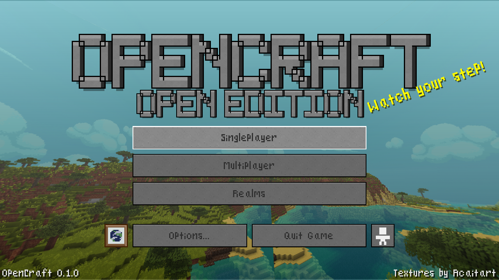
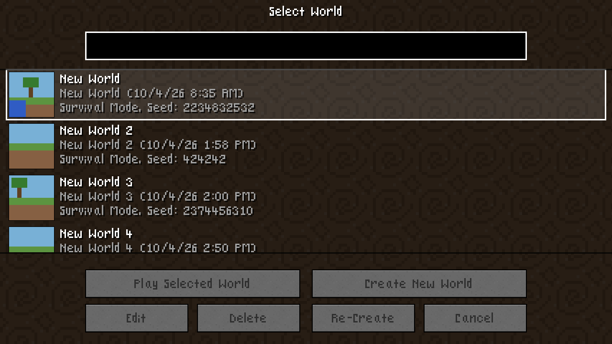
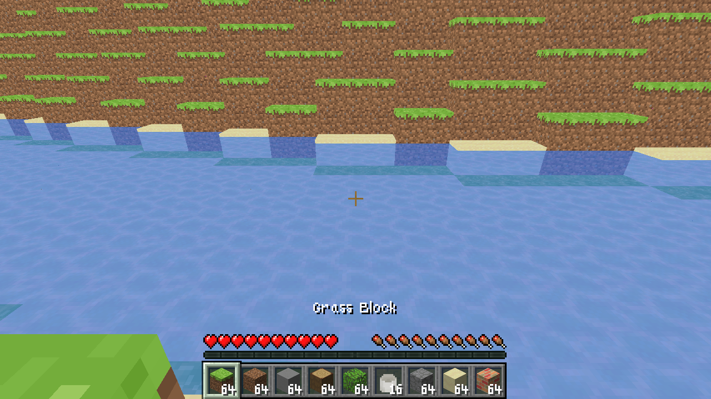
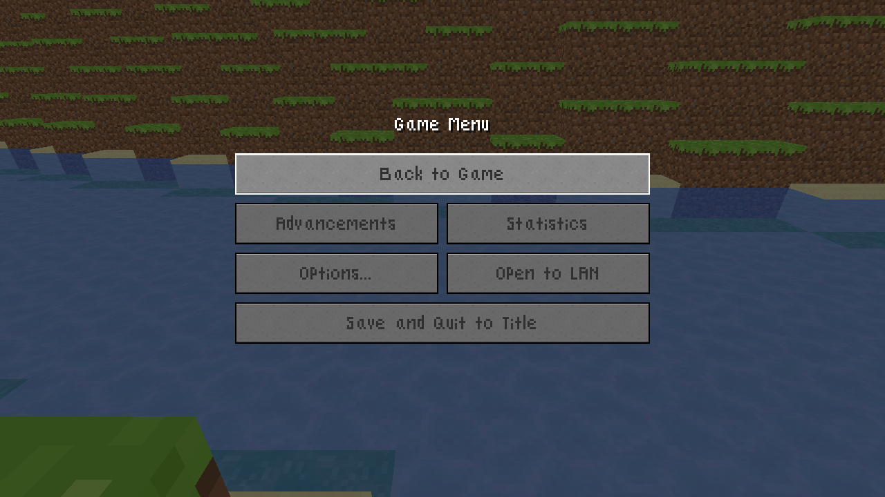

## OpenCraft



### Description

An open-world voxel game built with raylib, featuring open world gameplay with infinite terrain generation, block building, and first-person exploration. Built using a modular chunk system for efficient rendering and world management.

The Java Edition parity tracker lives in `docs/parity/`. `docs/parity/SLICES.md` is the ordered work, and `docs/parity/AGENT.md` is how an agent session takes one slice.

### Features

 - **First-person 3D exploration** with smooth WASD movement and mouse look
 - **Infinite voxel world** with chunk-based loading and procedural terrain generation
 - **Block interaction system** - place and destroy blocks with left/right mouse clicks
 - **Multiple block types** - grass, dirt, stone, wood, leaves, water
 - **Hotbar inventory** with 9 slots for different block types
 - **Realistic physics** - gravity, collision detection, and jumping
 - **Optimized rendering** - face culling, frustum culling, and efficient mesh generation
 - **Procedural terrain** - hills, valleys, water bodies, and tree generation

### Menu



The game opens on the OpenCraft title screen.

- **Singleplayer** opens the world list. Play a world, create one, edit the name, re-create it, or delete it.
- **Multiplayer** and **Realms** are listed and marked coming soon.
- **Options...** and **Quit Game** do what they say.

Worlds live in `saves/world_<id>/`. `level.dat` is gzip NBT for the name, seed, spawn, and player. Edited chunks are zlib NBT in `region/r.<x>.<z>.mca`. `level.txt` is the menu index. Client output goes to `logs/latest.log`, and the next launch gzips that file to `logs/YYYY-MM-DD-N.log.gz`.

A new world gets a random seed. The create screen accepts a seed too; leave it blank to keep the random one. Hills, water, and trees are rebuilt from that seed. Blocks you place stay in the region file.

Water is a source block. It spreads seven steps, falls down holes, and becomes a new source where two sources meet on solid ground. Lakes and oceans fill the low ground with sand beds. A new world starts on a shore. The bucket on the hotbar picks up a source and places it again. Space swims while you are in the water.

### In game



The hotbar, crosshair, and world readout stay on screen while you move. Escape opens the pause menu.



### Controls

Keyboard:
 - **WASD** - Move player
 - **SPACE** - Jump
 - **SHIFT** - Run/Sprint
 - **1-9** - Select block type from hotbar
 - **ESC** - Pause the game
 - **ENTER** - Return to main menu

Mouse:
 - **Mouse Movement** - Look around (first-person camera)
 - **Left Click** - Break/destroy blocks
 - **Right Click** - Place selected block


## Getting Started

### CMake

- Extract the zip of this project
- Type the follow command:

```sh
cmake -S . -B build
```

> if you want with debug symbols put the flag `-DCMAKE_BUILD_TYPE=Debug`

- After CMake config your project build:

```sh
cmake --build build
```

- Inside the build folder are another folder (named the same as the project name on CMakeLists.txt) with the executable and resources folder.
- In order for resources to load properly, cd to `src` and run the executable (`../build/${PROJECT_NAME}/${PROJECT_NAME}`) from there.

- cmake will automatically download a current release of raylib but if you want to use your local version you can pass `-DFETCHCONTENT_SOURCE_DIR_RAYLIB=<dir_with_raylib>`

### Shared setup

From the repo root:

```sh
bash .agents/setup.sh
bash .agents/build.sh
bash .agents/test.sh
```

`.agents/README.md` covers what each script does. The game still has to be launched from `src/` so it can find `resources/`. 
